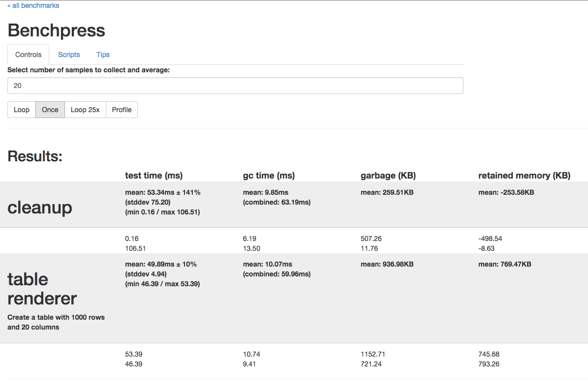
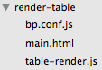
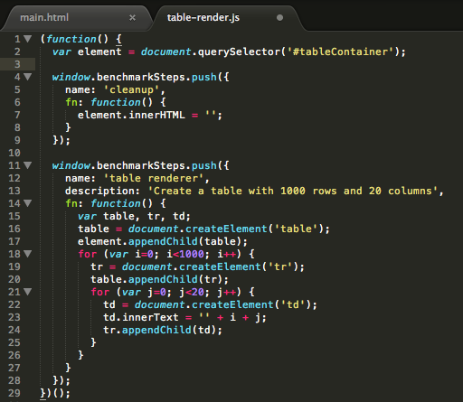

(this is from a lightning talk given at the
[AngularJS Mountain View meetup](http://www.meetup.com/AngularJS-MTV/events/218598545/)
on Nov 18, 2014)

# Benchpress Preview

## Jeff Cross

### @jeffbcross on Github & Twitter


<br><br><br><br>
<br><br><br><br>
<br><br><br><br>


## obligatory definition

### Benchpress is a tool to run macro JavaScript benchmarks of apps to measure perf characteristics



### AngularJS, AngularDart, and Angular2 use it

### it's not just for Angular apps

### you can use it today, but it's changing rapidly


<br><br><br><br>
<br><br><br><br>
<br><br><br><br>


## why

### performance is often overlooked

### perf analysis/improvement usually is reactive to user feedback

### already great tools for micro benchmarks, like jsperf/benchmarkjs

### Benchpress wants to make measuring real-world scenarios easier


<br><br><br><br>
<br><br><br><br>
<br><br><br><br>


## example - large table

### we want to measure how long it takes to render a table with many rows and columns

### and we want to see how much memory is generated when creating and destroying the table

### so we create a standalone app to be measured, including a benchpress config



### in our app, we'll add *steps* to be run and measured by benchpress



### I want to see the performance penalty of adding random background colors to each table cell

### so we'll add *variables* to see how the steps perform under different conditions

```javascript
bp.variables.addMany([{
  value: 'baseline'
},{
  value: 'colorful'
}]);
```

### and incorporate the variable into the benchmark step

```javascript
if (bp.variables.selected && bp.variables.selected.value === 'colorful') {
  td.style.backgroundColor =
    'rgb(' +
    Math.round(Math.random() * 255) + ', ' +
    Math.round(Math.random() * 255) + ', ' +
    Math.round(Math.random() * 255) + ')';
  }
```

### we'll compile our benchmark

```shell
$ benchpress build
```

### we'll start the benchpress server

```shell
$ benchpress run
```

### we'll launch chrome canary

```shell
$ benchpress launch_chrome
```

### we'll run with the baseline variable

### we'll run with the colorful variable


<br><br><br><br>
<br><br><br><br>
<br><br><br><br>


## tips

### focus on relieving memory pressure and reducing dom manipulation

### use provided launcher to launch chrome canary with proper flags

### run each test run in a fresh incognito browser window

### back away from the keyboard and mouse while a benchmark is running


<br><br><br><br>
<br><br><br><br>
<br><br><br><br>


## next

### auto-run mode

### karma plugin

### CI process integration

### time-series reporting tool

### more integrated CL comparison

### declarative benchmark suite library

### improvements to manual run reporting app


<br><br><br><br>
<br><br><br><br>
<br><br><br><br>


# thanks

## https://github.com/jeffbcross/bp-lightning
## https://github.com/angular/benchpress

